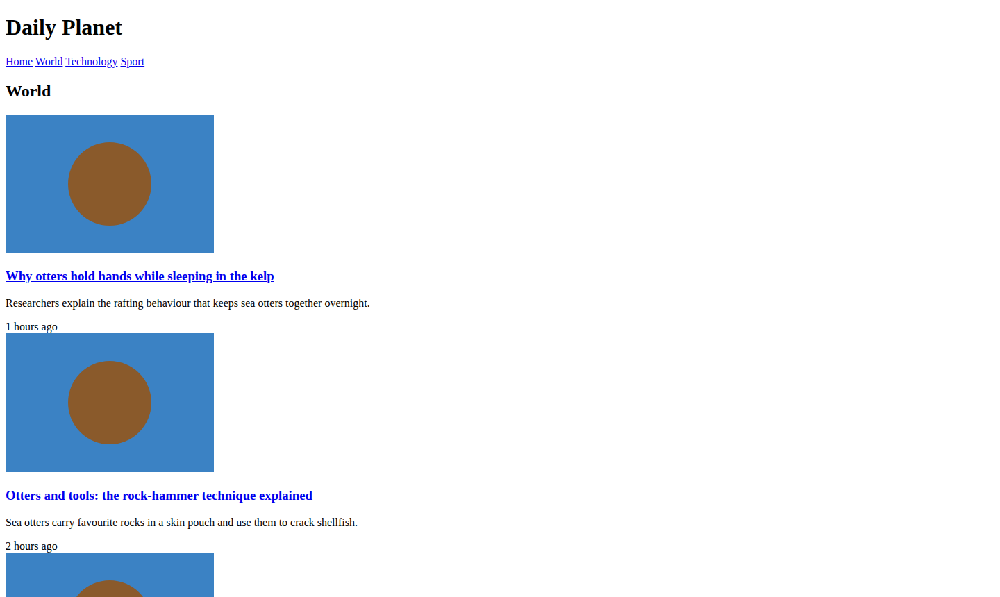
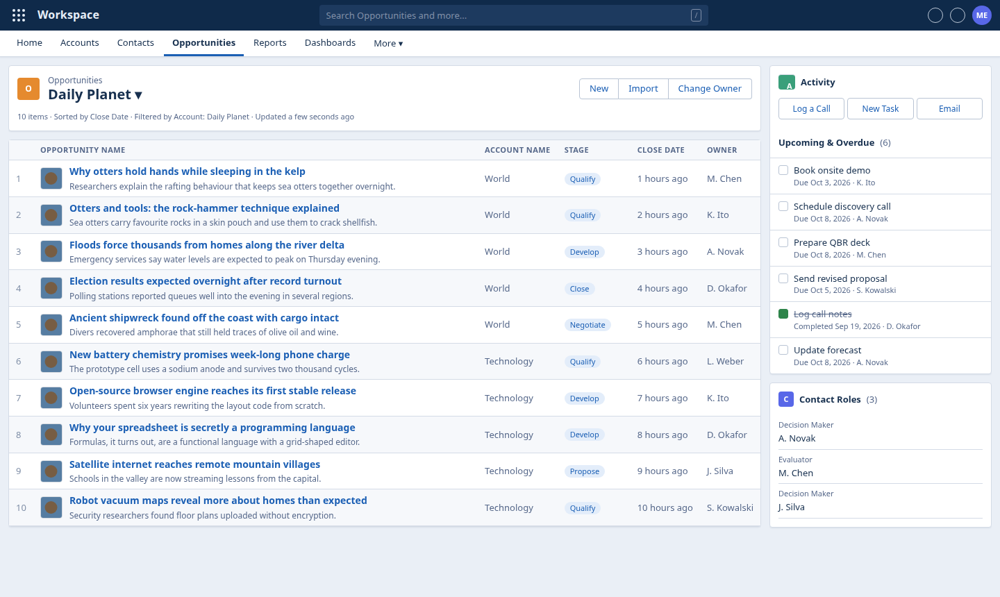
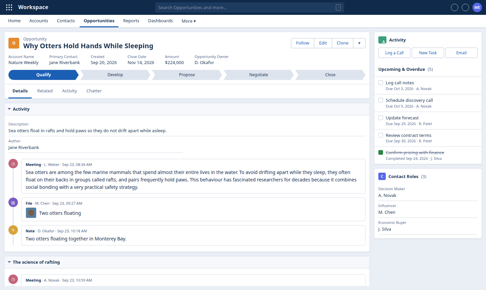
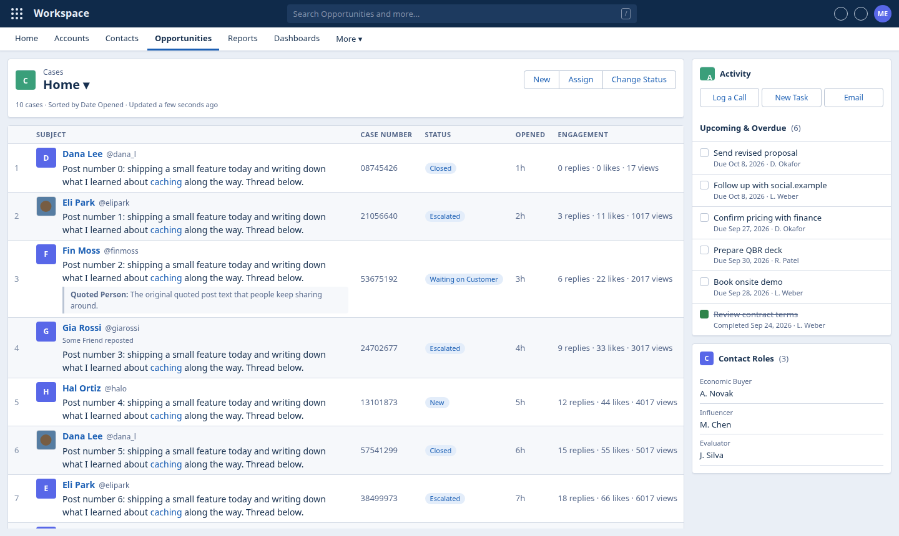
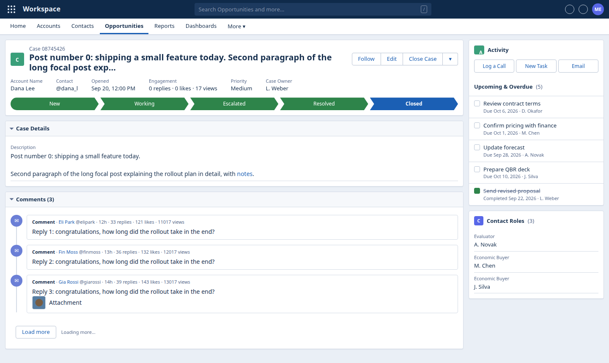

# Pro Look

**Read the news, blogs and X while your screen looks like you are busy in a business CRM.**

Pro Look is a Chrome extension. Press one shortcut and the website you are reading is redrawn as a sober, blue-grey sales app: headlines become "opportunities", article paragraphs become "emails" and "call notes" in an activity timeline, tweets become support "cases", and pictures shrink to tiny thumbnails that look like file icons. You can still read everything; from across the room it just looks like work.

| Before | After (Ctrl+Shift+X) |
| --- | --- |
|  |  |

---

## Contents

- [What it does](#what-it-does)
- [Install it (about 3 minutes)](#install-it-about-3-minutes)
- [How to use it](#how-to-use-it)
- [If something does not work](#if-something-does-not-work)
- [Update or remove it](#update-or-remove-it)
- [Privacy](#privacy)
- [For developers](#for-developers)

---

## What it does

- **News and blog home pages** turn into a list of *Opportunities*. Every headline is a row you can click, with its summary and a small thumbnail.
- **Articles and blog posts** turn into an *Opportunity record*. The real site, author and date sit in the header, and every paragraph appears in reading order as an entry in the activity timeline. Menus and adverts are moved out of the way.
- **X (Twitter)** timelines turn into a list of *Cases*: author, full post text, quoted posts and likes/replies/views. Keep scrolling and more posts load. Opening a post shows it as a *Case* with the replies as comments.
- The **tab title and icon** change too ("Opportunity | Workspace"), and any playing video or sound is paused.
- One more press of the shortcut brings the real page straight back.

| An article | X timeline | A single post with replies |
| --- | --- | --- |
|  |  |  |

---

## Install it (about 3 minutes)

Pro Look is not in the Chrome Web Store, so you install it "by hand". Chrome allows this, and you only do it once. You need **Google Chrome** on a computer (Windows, Mac or Linux). It will not work on phones.

> **Work computer?** Some companies switch off the option used in step 4. If the **Developer mode** switch is greyed out or missing, your IT department has blocked extensions installed by hand, and Pro Look cannot be installed on that computer.

### Step 1: Download

1. Open the **[latest release page](https://github.com/workszop/pro-look/releases/latest)**.
2. Under **Assets**, click **`pro-look.zip`**. It downloads to your *Downloads* folder.

### Step 2: Unzip it and put the folder somewhere safe

1. Find `pro-look.zip` in your *Downloads* folder.
   - **Windows:** right-click it and choose **Extract All...**, then click **Extract**.
   - **Mac:** double-click it.
   - **Linux:** right-click it and choose **Extract Here**.
2. You now have a folder called **`pro-look`**. Move it somewhere you will not delete it by accident, for example your *Documents* folder.

> Chrome runs the extension straight from this folder. If you delete or move the folder later, the extension stops working (see [Update or remove it](#update-or-remove-it)).

### Step 3: Open Chrome's extensions page

Click the address bar at the top of Chrome, type **`chrome://extensions`** and press **Enter**.

(Or use the menu: the three dots **⋮** in the top-right corner, then **Extensions**, then **Manage Extensions**.)

### Step 4: Turn on Developer mode

In the **top-right corner** of the extensions page there is a switch labelled **Developer mode**. Click it so it turns on (blue).

This is safe. It only adds buttons that let you install an extension from a folder on your computer.

### Step 5: Load the folder

1. Click **Load unpacked**. It appears in the **top-left** once Developer mode is on.
2. A folder window opens. Go to where you put the **`pro-look`** folder, click it once to select it, and click **Select Folder** (Mac: **Select**).
   - Pick the `pro-look` folder itself, the one that contains a file called `manifest.json`, not a folder inside it or above it.
3. A **Pro Look** card appears on the page. Installation is done.

### Step 6: Pin the icon (recommended)

1. Click the **puzzle-piece icon** to the right of the address bar.
2. Find **Pro Look** and click the **pin** next to it.

A small blue icon with three bars now sits next to the address bar. Clicking it turns the disguise on and off.

### Step 7: Try it

Open any news site, for example a newspaper's home page, and press **Ctrl + Shift + X** (on a Mac: **Command + Shift + X**). Press it again to go back.

---

## How to use it

| To do this | Do this |
| --- | --- |
| Turn the disguise on or off | **Ctrl + Shift + X** (Mac: **Command + Shift + X**), or click the Pro Look icon |
| Open an article or post | Click its title (blue text) in the list, like any link |
| Go back | Use the browser's normal **Back** button. The disguise stays on |
| Search the page | Press **/** and type. Only matching rows stay visible |
| Jump between rows or sections | **j** (next) and **k** (previous), then **Enter** to open |
| Load more posts (X and similar) | Just scroll to the bottom, or click **Load more** |
| Close a picture preview or clear the search | **Esc** |

**Pictures:** they are shown as small thumbnails so they look like file icons. Click one to see it bigger, and press **Esc** to close it.

**Always disguise a site:** right-click the Pro Look icon and tick **Always disguise [site name]**. That site will then open disguised every time. Right-click again to untick it.

**Settings:** right-click the Pro Look icon and choose **Options** to:
- edit the list of always-disguised sites,
- make the layout **Compact** (smaller, denser, even more "spreadsheet"),
- change how big the picture thumbnails are.

Click **Save** when you are done.

---

## If something does not work

**Nothing happens when I press the shortcut.**
- Click once anywhere on the web page first, then press the shortcut again. The key only works while the page itself is in focus (not while you are typing in the address bar).
- Tabs that were already open before you installed Pro Look need to be reloaded once: press **F5** (Mac: **Command + R**).
- Chrome may not have registered the shortcut. Go to **`chrome://extensions/shortcuts`**, find **Pro Look**, click the pencil next to *Toggle the CRM disguise on the current tab*, and press **Ctrl + Shift + X** (or any combination you like). Once it is registered this way, it works even while the address bar is selected.
- You can always click the Pro Look icon instead.

**The icon shows a "–" and nothing happens.**
Chrome does not let any extension change its own pages: the new tab page, `chrome://` pages, the Chrome Web Store and built-in PDF viewing. Open a normal website instead.

**The disguised page says "No records to display" or looks nearly empty.**
Some pages have very little text to show: login pages, video players, maps, web apps. Turn the disguise off for those pages.

**Chrome shows a warning about "developer mode extensions".**
Some versions of Chrome show this now and then for any extension installed by hand. It is expected; close the message (do not choose to disable the extension).

**X (Twitter) notes.**
- You need to be logged in to X as usual.
- In the timeline, long posts are shortened just like on X itself. Click the author's name to open the full post.
- Videos do not play inside the disguise, and you cannot like or reply from it. Turn the disguise off, do it, and turn it back on.

**The extension disappeared or shows an error after I moved files around.**
Chrome needs the `pro-look` folder to stay where you loaded it from. Put it back, or remove the extension and repeat [Step 5](#step-5-load-the-folder) with the folder's new location.

**A reminder:** Pro Look only changes what is shown on your screen. It does not hide which websites you visit from your company's network, IT software or browser history.

---

## Update or remove it

**Update to a new version**
1. Download the new `pro-look.zip` from the **[latest release page](https://github.com/workszop/pro-look/releases/latest)** and unzip it.
2. Replace the contents of your existing `pro-look` folder with the new files (same folder, same place).
3. Go to **`chrome://extensions`** and click the round **reload arrow** on the Pro Look card.
4. Reload any tabs you want to use it in.

**Remove it**
Go to **`chrome://extensions`**, click **Remove** on the Pro Look card, and confirm. You can then delete the `pro-look` folder.

---

## Privacy

- **Everything happens inside your browser.** Pro Look has no servers, accounts, analytics or tracking, and it never sends the pages you read anywhere.
- When you install it, Chrome warns that it can "read and change all your data on all websites". It needs this to redraw the pages you visit. Its small helper script is present on every page so the shortcut responds instantly, but it only reads and redraws a page when you turn the disguise on for that page (or have marked the site as always disguised).
- The only things it stores are your settings (the always-disguised site list, density and thumbnail size), kept in Chrome's own settings storage.
- The fake names, amounts and tasks in the CRM are generated on your computer and are not real data.

**Other browsers:** Microsoft Edge and Brave are built on the same engine as Chrome and should work with the same steps (use `edge://extensions` or `brave://extensions`; in Edge the *Developer mode* switch is in the left-hand menu). They have not been tested. Firefox and Safari are not supported.

---

## For developers

Manifest V3, plain JavaScript, no build step. The extension is the repository root: load it with *Load unpacked*.

| File | Role |
| --- | --- |
| `manifest.json` | Permissions, `Ctrl+Shift+X` command, content scripts (run at `document_start`) |
| `background.js` | Service worker: per-tab on/off state (`storage.session`), always-on hosts (`storage.sync`), badge, context menu, delivers settings and CSS |
| `content/main.js` | Controller: hides the page before first paint when disguised, mounts after DOM parse, re-extracts on SPA changes, accumulates feed posts, drives load-more, in-page shortcut fallback |
| `content/extract.js` | Page to Model: detects page kind (`feed` / `index` / `article`), uses Mozilla Readability for articles with a DOM-walker fallback, tidies page chrome. Pure and unit-tested |
| `content/render.js` | Model to CRM UI inside a Shadow DOM overlay (page CSS cannot leak in); publishes a `data-pl-*` DOM contract on `#pro-look-root` |
| `content/skin.css` | All colours, fonts and sizes as tokens on `:host`; reskin here |
| `content/Readability.js` | Vendored [Mozilla Readability](https://github.com/mozilla/readability) (Apache License 2.0) |

```bash
npm install          # jsdom + Readability for tests
npm test             # extractor unit tests on fixtures (incl. X-like feeds)
npm run e2e          # real Chromium + the unpacked extension; reads the data-pl-* contract, writes shots/
npm run zip          # builds dist/pro-look.zip for a release
EXT_DIR=/path/to/unzipped/pro-look npm run e2e   # test exactly what users install
```

The e2e run needs Chrome for Testing (branded Chrome 137+ ignores `--load-extension`); set `CHROME_BIN` and `PW_MODULE` if yours live elsewhere.
